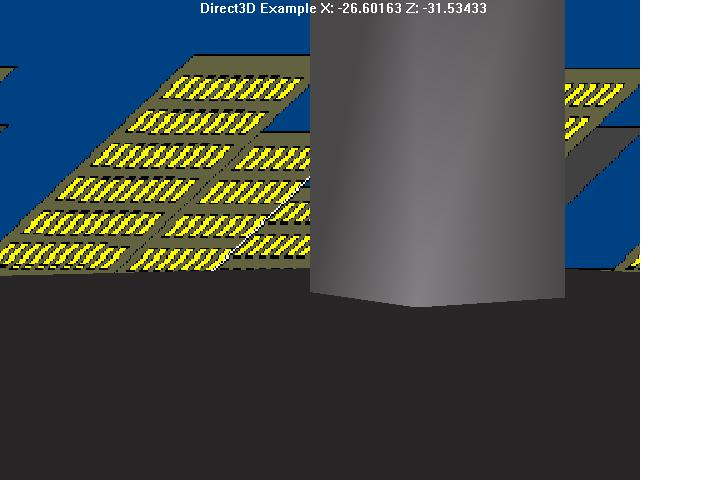



## \_\_Direct3D Tutorial \[Updated\]\_\_

### Description

A Tutorial on how to do Direct3D7 Retained Mode Graphics! HTML file and an example! Every line of code is commented and easy to understand. Begin making 3D Games with this article! I WORKED A LONG TIME ON THIS ARTICLE! If you like it, PLEASE VOTE FOR ME on PSC :) I am also planning on putting out a 3D flight simulator soon so keep lookin-
 
### More Info
 

             |
---                |---
**Submitted On**   |2002-01-06 08:17:28
**By**             |[Matt Carpenter](https://github.com/Planet-Source-Code/PSCIndex/blob/master/ByAuthor/matt-carpenter.md)
**Level**          |Intermediate
**User Rating**    |4.7 (602 globes from 127 users)
**Compatibility**  |VB 6\.0
**Category**       |[DirectX](https://github.com/Planet-Source-Code/PSCIndex/blob/master/ByCategory/directx__1-44.md)
**World**          |[Visual Basic](https://github.com/Planet-Source-Code/PSCIndex/blob/master/ByWorld/visual-basic.md)
**Archive File**   |[\_\_Nice\_Dir46440152002\.zip](https://github.com/Planet-Source-Code/matt-carpenter-direct3d-tutorial-updated__1-30284/archive/master.zip)

### Source Code

Download the tutorial and example source code :)
<B>You may find this example really boring</b> so
make it more exciting your self. Try making a 3D maze! Or maybe a racing game! What? You don't have any clue how? You will if you read this tutorial!  
After you read it: 
<b>1:</b> Rate this- I'd like to hear what you think! 
<B>2:</b> Make your own cool D3D Game

